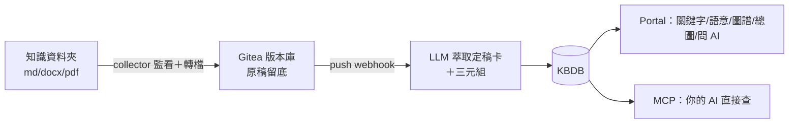

# Arcrun RAG — 把檔案丟進資料夾，公司知識庫自動長出來

**丟檔案 → AI 讀完重寫成定稿知識卡 → 三種方式查（關鍵字／語意／知識圖譜）→ 直接問 AI 拿帶出處的答案。**
self-hosted：裝在你自己的 Cloudflare 帳號或你自己的電腦，資料完全屬於你，不是 SaaS。

## 30 秒看懂它跟「裸 RAG」差在哪

一般 RAG 把原始文件切塊直接餵向量庫——庫越大越髒。Arcrun RAG 走 **LLM Wiki 策略**：
原稿先由 LLM 萃取重寫成**定稿知識卡**（含一句話定義、要點、實體、知識關聯），只有定稿被檢索；
原稿零進庫、留在 git 可回溯。知識關聯自動織成圖譜，整座庫還有一張機械計算的
[總庫地圖](https://git.uncle6.me/Leo/arcrun-rag-demo-knowledge/src/branch/main/system-dev/wiki/00-MAP.md)——把它注入任何 AI，開場就知道館藏全貌。

## 先玩再說（2 分鐘，免安裝免註冊）

**https://rag-demo.arcrun.dev/portal**　（封測帳密見 [5 分鐘測試指南](docs/demo/客戶測試指南.md)，或向我們索取）

👉 照著 **[5 分鐘測試指南](docs/demo/客戶測試指南.md)** 走一輪：上傳一份文件 → 一分鐘後三種搜尋＋總圖＋問 AI。


上傳的文件真身存在公開知識庫 [arcrun-rag-demo-knowledge](https://git.uncle6.me/Leo/arcrun-rag-demo-knowledge)——
你可以親眼看到 AI 萃出來的[定稿卡](https://git.uncle6.me/Leo/arcrun-rag-demo-knowledge/src/branch/main/system-dev/wiki/cards)長什麼樣。
（共用測試環境、每日清空，請勿放敏感資料。）

## 玩完想裝？（一種做法：裝在你自己的 Cloudflare 帳號）

正式版裝在**你自己的 CF 帳號**——免費層即可起步，資料完全屬於你，同事打網址就能用，語意查詢啟用。demo 站就是這樣裝出來的。

前置三樣（都免費）：**Cloudflare 帳號＋API Token**、**Google AI Studio key**、**會跑指令的 AI**（Claude Code / Cursor…）。

然後把這段貼給你的 AI：

```text
請幫我把 Arcrun RAG 裝到我自己的 Cloudflare 帳號：
1. git clone https://git.uncle6.me/Leo/Arcrun.git ~/Arcrun
2. git clone https://git.uncle6.me/Leo/arcrun-rag.git && cd arcrun-rag
3. 讀 docs/manual/cf-install-guide.md，照它一步步執行；
   需要我提供的東西（CF token、Account ID、Gemini key）再開口問我。
成功判準：/portal 登入 → 上傳一份 md → 一分鐘內搜得到、總圖長出節點、
問 AI 拿到帶出處的答案。撞牆就把完整錯誤訊息整理給我。
```

📌 封測期：手冊是 v1、粗糙點都誠實標在裡面——卡住直接把錯誤丟回給邀請你的人，我們陪裝、通常當天修。

<details>
<summary>進階：全本機測試版（不需要 CF 帳號；混合較多底層概念，不推薦入門）</summary>

```bash
git clone https://git.uncle6.me/Leo/Arcrun.git ~/Arcrun
git clone https://git.uncle6.me/Leo/arcrun-rag.git && cd arcrun-rag
./install/install.sh        # 前置：Docker、Node.js 20+、Python 3
```

逐步教學：[本機安裝手冊](docs/manual/product-install-guide.md)／[完整測試指南](docs/manual/local-test-guide.md)。全部移除：`./install/teardown.sh`。

</details>

## 它如何運作（一張圖）



細節（分層、為什麼走 git、刪檔下架機制）見 [install.md](install.md)。

## 版本

| 版本 | 說明 | 狀態 |
|---|---|---|
| 企業雲端版 | 多人＋庫級權限，裝在客戶自己的 CF 帳號 | **封測中**（demo 站＝實例） |
| 企業地端版 | 全地端（workerd/SQLite/Ollama） | spike 陽性，開發排程中 |
| 個人版 | 原作者 dogfood 實例 | 不在本 repo |

## 封測回饋

跑不起來、覺得哪裡怪、想要什麼功能——都要聽：
在本 repo [開 issue](https://git.uncle6.me/Leo/arcrun-rag/issues)（需 Gitea 帳號，找 leo 開）或直接回訊給邀請你的人，
附上：跑到哪一步、完整指令與錯誤訊息、`node --version`。

## 這個 repo 是什麼／不是什麼

- **是**：產品的組裝與交付 repo——安裝器、收集器（Markitdown 轉檔）、demo workflows、產品文件與 SDD。
- **不是**：第二份核心程式碼。核心改動一律上游化到 [Arcrun](https://git.uncle6.me/Leo/Arcrun) 走 PR，本 repo 不 fork 核心。
- 產品規劃真相源：[docs/1-vision/rag-product-plan.md](docs/1-vision/rag-product-plan.md)；SDD：`system-dev/docs/3-specs/`。
