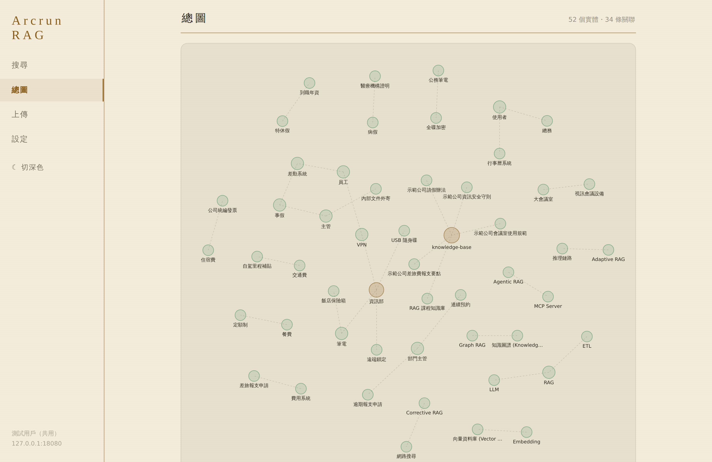
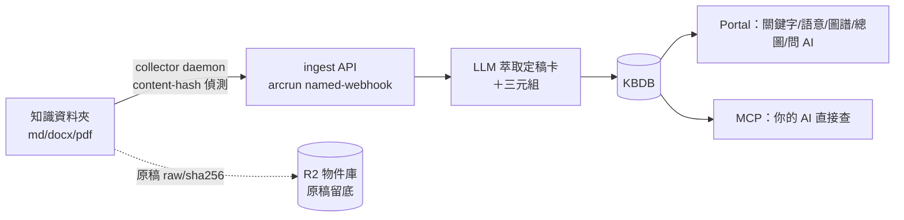

# Arcrun RAG — 把檔案丟進資料夾，公司知識庫自動長出來

**丟檔案 → AI 讀完重寫成定稿知識卡 → 三種方式查（關鍵字／語意／知識圖譜）→ 直接問 AI 拿帶出處的答案。**
self-hosted：裝在你自己的 Cloudflare 帳號或你自己的電腦，資料完全屬於你，不是 SaaS。
跑在 [Arcrun](https://github.com/youlinhsieh/Arcrun)（開源、AI-friendly 的工作流引擎）上。

## 30 秒看懂它跟「裸 RAG」差在哪

一般 RAG 把原始文件切塊直接餵向量庫——庫越大越髒。Arcrun RAG 走 **LLM Wiki 策略**：
原稿先由 LLM 萃取重寫成**定稿知識卡**（含一句話定義、要點、實體、知識關聯），只有定稿被檢索；
原稿零進庫、以內容雜湊（sha256）存物件庫可回溯。知識關聯自動織成圖譜，整座庫還有一張機械計算的
**總庫地圖**（哪些主題、各有多少張卡、彼此怎麼連）——把它注入任何 AI，開場就知道館藏全貌。

## 先看看它長什麼樣

**目前沒有公開試玩站**——早期那個共用示範站已退場（2026-08-08）。
要真的動手，就是**裝一套到你自己的 Cloudflare 帳號**（免費層即可起步，見下一節「怎麼裝」）；
裝好之後照 **[Portal 5 分鐘導覽](docs/demo/客戶測試指南.md)** 走一輪，就能把功能全摸過一遍。



## 怎麼裝

**現在最快的路——不用終端機、不用寫程式**：

1. 到 **[rag.arcrun.dev](https://rag.arcrun.dev)** 留 Email，領一組「辨識碼」（封測期的邀請碼，會寄到信箱）。
2. 到 **[install.arcrun.dev](https://install.arcrun.dev)** 輸入 Email／辨識碼、按「開始安裝」——會跳到 Cloudflare 官方頁面請你確認授權，裝好會直接給你一個只有你能用的網址（資料在你自己的 Cloudflare 帳號裡）。
3. 依畫面指示下載「同步器」（Mac／Win 桌面程式）——指給它一個資料夾，之後丟進去的檔案就自動變知識庫。

裝好之後照 **[Portal 5 分鐘導覽](docs/demo/客戶測試指南.md)** 走一輪，就能把功能全摸過一遍。

📌 封測期：卡住直接把跑到哪一步／完整錯誤訊息丟回給邀請你的人（或到 [rag.arcrun.dev/support](https://rag.arcrun.dev/support)），我們陪裝、通常當天修。

<details>
<summary>進階：不想等辨識碼、想自己從原始碼部署到自己的 Cloudflare 帳號</summary>

適合對 Cloudflare／IT 有經驗、想先看代碼再裝的人。前置三樣（都免費）：**Cloudflare 帳號＋API Token**、**Google AI Studio key**、**會跑指令的 AI**（Claude Code / Cursor…）。

把這段貼給你的 AI：

```text
請幫我把 Arcrun RAG 裝到我自己的 Cloudflare 帳號：
1. git clone https://github.com/youlinhsieh/Arcrun.git ~/Arcrun
2. git clone https://github.com/youlinhsieh/arcrun-rag.git && cd arcrun-rag
3. 讀 docs/manual/cf-install-guide.md，照它一步步執行；
   需要我提供的東西（CF token、Account ID、Gemini key）再開口問我。
成功判準：/portal 登入 → 上傳一份 md → 一分鐘內搜得到、總圖長出節點、
問 AI 拿到帶出處的答案。撞牆就把完整錯誤訊息整理給我。
```

</details>

<details>
<summary>更進階：全本機測試版（不需要 CF 帳號；混合較多底層概念，僅供工程評估，不推薦入門）</summary>

```bash
git clone https://github.com/youlinhsieh/Arcrun.git ~/Arcrun
git clone https://github.com/youlinhsieh/arcrun-rag.git && cd arcrun-rag
./install/install.sh        # 前置：Docker、Node.js 22+
```

逐步教學：[本機安裝手冊](docs/manual/product-install-guide.md)／[完整測試指南](docs/manual/local-test-guide.md)。全部移除：`./install/teardown.sh`。

</details>

## 它如何運作（一張圖）


```mermaid
flowchart LR
    A[知識資料夾<br>md/docx/pdf] -->|collector daemon<br>content-hash 偵測| B[ingest API<br>arcrun named-webhook]
    A -.->|原稿 raw/sha256| R[(R2 物件庫<br>原稿留底)]
    B --> C[LLM 萃取定稿卡<br>＋三元組]
    C --> D[(KBDB)]
    D --> E[Portal：關鍵字/語意/圖譜/總圖/問 AI]
    D --> F[MCP：你的 AI 直接查]
```

細節（content-hash 怎麼偵測增刪改、刪檔下架機制）見 [collector/README.md](collector/README.md)。

> ✅ collector（本機 Go daemon，即上面的「同步器」）以 content hash 偵測增刪改、原稿
> content-addressed 上 R2、直打 ingest API——**不經 git、不經 Gitea**。
> 過渡期例外：portal 內的手動「上傳」頁仍走舊 Gitea 鏈（並行部署，對使用者無感）。

## 版本

| 版本 | 說明 | 狀態 |
|---|---|---|
| 企業雲端版 | 多人＋庫級權限，裝在客戶自己的 CF 帳號 | **封測中**（每位封測者各自一套實例，無共用試玩站） |
| 企業地端版 | 全地端（workerd/SQLite/Ollama） | spike 陽性，開發排程中 |
| 個人版 | 原作者 dogfood 實例 | 不在本 repo |

## 封測回饋

跑不起來、覺得哪裡怪、想要什麼功能——都要聽：
在公開鏡像 [開 issue](https://github.com/youlinhsieh/arcrun-rag/issues)（有 GitHub 帳號即可）或直接回訊給邀請你的人，
附上：跑到哪一步、完整指令與錯誤訊息、`node --version`。

## 這個 repo 是什麼／不是什麼

- **是**：產品的組裝與交付 repo——一鍵安裝器（`installer/`）、桌面同步器／收集器（`collector/`，純 Go 文件轉檔，不需另裝 Python）、RAG workflows、產品文件與 SDD。
- **不是**：第二份核心程式碼。核心改動一律上游化到 [Arcrun](https://github.com/youlinhsieh/Arcrun) 走 PR，本 repo 不 fork 核心。
- 產品規劃與內部 SDD 不在公開鏡像裡（只在私有真相源）。這裡公開的是**裝得起來、跑得動**所需的東西：
  [安裝手冊](docs/manual/cf-install-guide.md)、[Portal 導覽](docs/demo/客戶測試指南.md)、[collector 架構說明](collector/README.md)。
