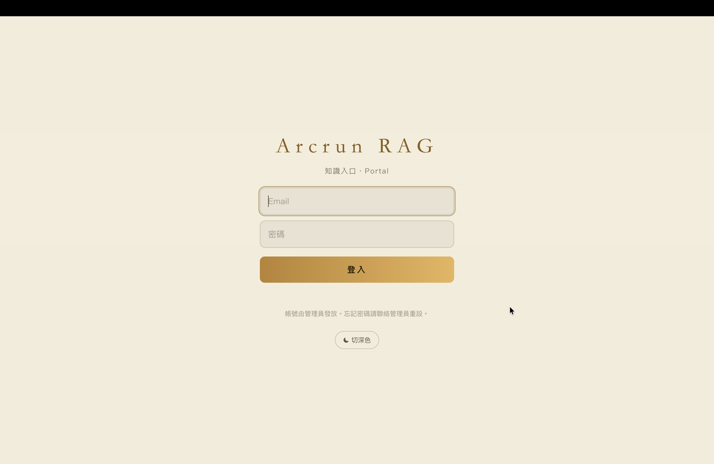
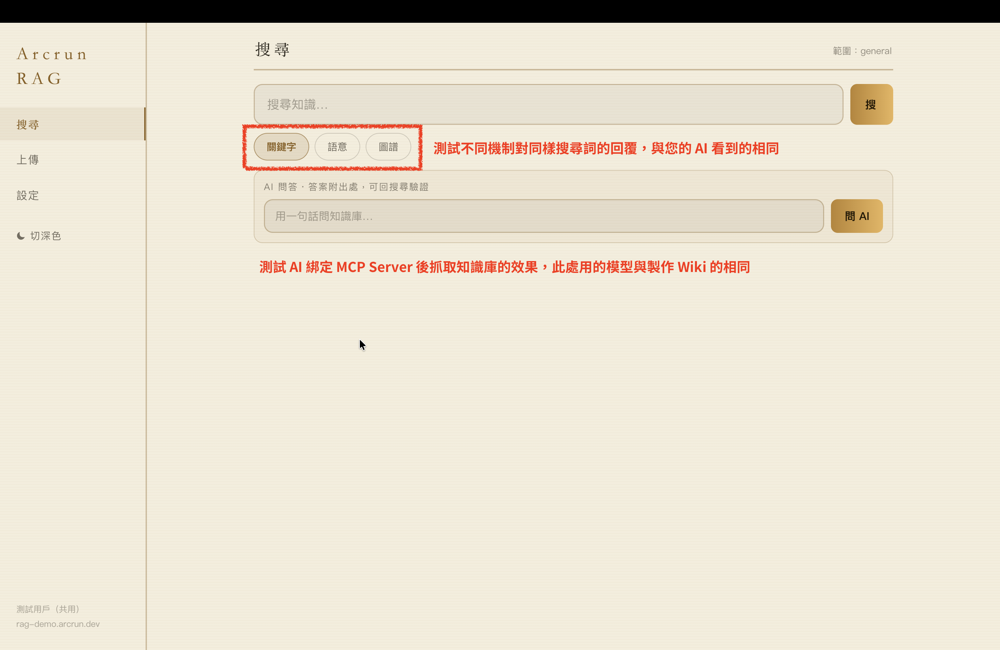
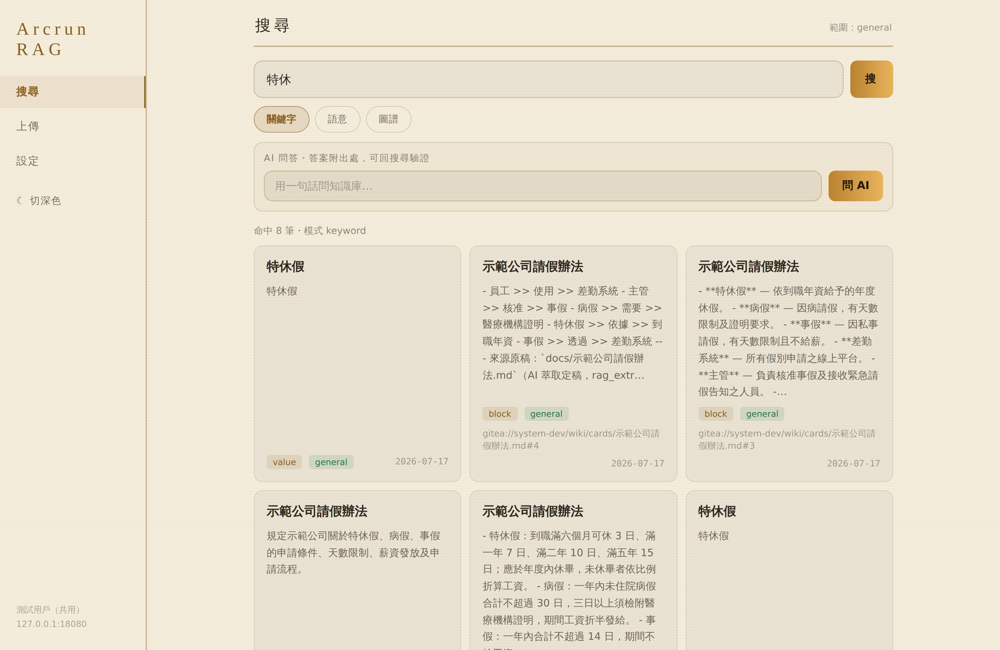
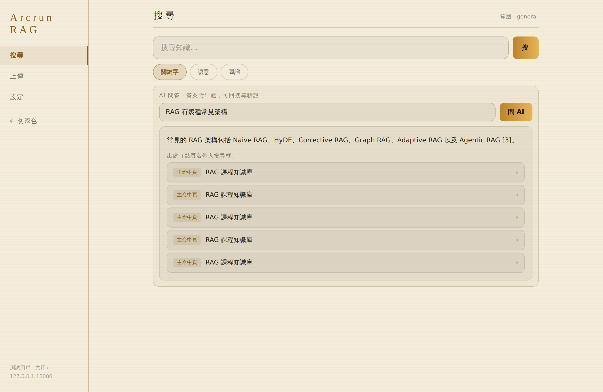

# Arcrun RAG — Portal 5 分鐘導覽

> 裝好之後照這一頁走一輪：**拖檔上傳 → 一分鐘後 AI 讀完 → 三種搜尋＋直接問 AI**，全程不離開畫面。
> 第一次跑，建議拿一份不敏感的內規／辦法／SOP 來試。

## 入口

**你自己的實例網址**：`https://arcrun-rag-ui.<你的 workers 子網域>.workers.dev/portal`
（安裝器跑完的最後一畫面會直接把這個網址給你，安裝手冊 `docs/manual/cf-install-guide.md` 也有。）

帳號密碼＝**你安裝時設定的管理員帳密**。

> 📌 **沒有公開的共用試玩站**。早期曾有一個共用示範站，已於 2026-08-08 退場；
> 現在每位使用者都是自己一套實例，資料在你自己的 Cloudflare 帳號裡。

## 步驟 1：上傳文件

左側「上傳」頁 → 把 `.md`/`.txt` 拖進虛線框（可多選）。Word/PDF 請先轉純文字（正式版會轉檔常用文件）。

原稿**不會**直接進資料庫：它以內容雜湊（sha256）存進你自己帳號的 R2 物件庫留底，
只有 AI 重寫出來的定稿卡會被檢索。

## 步驟 2：等 AI 編譯（約 1 分鐘）

到「搜尋」頁搜文件裡的詞——先出現**原文段落**；再等一下會多出 **AI 重寫的定稿知識卡**內容。

## 步驟 3：測試三種搜尋方式

搜尋框下有三顆模式按鈕——**同一個搜尋詞，三種機制各自怎麼答**，和你的 AI 之後看到的完全相同：

- **關鍵字**：精確詞，如「特休」。命中的卡片會帶出處路徑（哪份文件的第幾段）：

  

- **語意**：白話問，如「出門在外怎麼連回公司」——原文沒這些字也找得到。
- **圖譜**：輸入實體名看知識關聯網，如 `RAG`、`VPN`、`特休假`（大小寫都可以，搜 `rag` 也會找到節點「RAG」）：

  

## 步驟 3.5：看「總圖」——整座知識庫一張網

左側「總圖」頁：所有文件萃出的知識關聯一次攤開，越核心的實體球越大、顏色越深。點任一節點直接跳到該實體的圖譜搜尋。

同一份地圖也有給 AI 看的文字版（`00-MAP.md`，機械計算的總庫目錄——把它注入任何 AI，
開場就知道館藏全貌，不用先搜尋）。想先看看它長什麼樣，可以看公開鏡像的
[範例總圖](https://github.com/youlinhsieh/arcrun-rag-demo-knowledge/blob/main/system-dev/wiki/00-MAP.md)
與[定稿卡](https://github.com/youlinhsieh/arcrun-rag-demo-knowledge/tree/main/system-dev/wiki/cards)（純靜態檔案、免登入）。

## 步驟 4：直接問 AI

搜尋頁的「AI 問答」框直接問，如「出差可以住多少錢的旅館？」——答案帶出處編號 [n]，點來源頁名可回搜尋自己驗證。**AI 檢索用的就是你手動搜的同一套**，這就是原理。

## 幕後（給懂工作流的你）

上傳→萃取（Gemma-4-31B 重寫定稿）→入庫→三元組→向量化，全部是 **Arcrun workflow** 事件驅動自動跑，零人工。原稿不進資料庫——只有 AI 定稿會被檢索（LLM Wiki 策略 vs 裸 RAG 的差別）。

## 已知邊界

- 上傳頁只收 `.md`/`.txt`；同名文件不覆蓋。
- 搜尋結果偶見無標題雜項列＝系統內部值，正式版會過濾。
