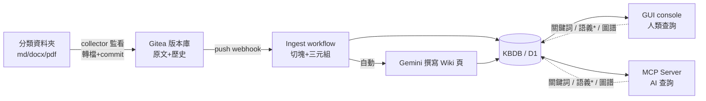

# Arcrun RAG — 安裝說明

> 你把檔案丟進資料夾，公司知識庫自動長出來。本文說明它是什麼、如何運作、兩種安裝方式、以及為什麼最終要裝正式版。

## Arcrun RAG 是什麼

很多企業需要 RAG（讓 AI 能查自己公司的知識），但 RAG 觀念複雜、難以自製。Arcrun RAG 把整套 RAG 元件——同步、轉檔、知識萃取、三種查詢——組合好一次提供，用戶不需要自行開發。

本產品用 [Arcrun](https://git.uncle6.me/Leo/Arcrun) 開發（開源工作流引擎，定位「AI-Friendly 的 n8n」），以高速的 Cloudflare 全球網路做基礎設施。**self-hosted、不是 SaaS**：正式版裝在你自己申請的 Cloudflare 帳號裡，你自己擁有所有數據；本機測試版連 Cloudflare 帳號都不用。

本機側使用 Docker（跑 Gitea 版本庫）、Node.js（檔案收集器）與 Python（markitdown 文件轉檔）。

## 它如何運作

系統自動同步你的檔案、用 LLM 產生 Wiki、萃取三元組建知識圖譜，儲存進 KBDB 供三種模式查詢。分成幾層：

1. **用戶的檔案儲存庫**：依照分類把檔案存在不同資料夾。收集器（collector）自動監看資料夾——新增、修改、刪除都會被即時偵測（事件驅動，秒級；不需等排程），docx/pptx/pdf 自動轉成 Markdown，原始檔留底。
2. **Gitea（版本庫）**：收集器把變更 commit + push 到 Gitea。git 天然以內容 hash 判定「哪些檔案真的改了」，只有真變更會觸發下一步（push 後 webhook 通知，不輪詢）。原文永遠留在 Gitea，可回溯每個版本。
3. **Ingest（Arcrun workflow）**：收到變更通知後自動把文件切塊寫入 KBDB（即 Cloudflare D1 資料庫），同時建立三元組（知識圖譜的邊）；接著自動呼叫 LLM（預設 Google Gemini）為文件撰寫 Wiki 摘要頁寫回知識庫。刪除的檔案會標記下架（deprecated），不會物理消失。
4. **KBDB（儲存與檢索層）**：D1 供關鍵詞查詢；正式版（Cloudflare 帳號）另將內容向量化存入 CF Vectorize 供語義查詢；三元組構成 Graph DB，是總庫知識地圖的基礎（總庫地圖視覺化在上游開發中）。
5. **查詢面**：GUI（console）供人類查詢、MCP Server 供你的 AI 直接查詢；支援關鍵詞、語義、圖譜三種搜尋。



\* 語義查詢需 Cloudflare 帳號（Vectorize + Workers AI）；本機測試版會自動降級為關鍵詞查詢。

## 安裝方式 1（推薦、唯一主線）：Cloudflare 帳號安裝

適合：正式導入與封測。裝在你自己的 CF 帳號（免費層可起步），資料完全屬於你、同事打網址即用、語意查詢啟用。demo 站就是這條路裝出來的。

👉 **[CF 安裝手冊（v1，建議由你的 AI 執行）](docs/manual/cf-install-guide.md)**

## 安裝方式 2（進階，不推薦入門）：本機測試安裝（不需要 Cloudflare 帳號）

適合：想全本機評估引擎的工程師。混合較多底層概念（miniflare/Gitea 容器/collector），入門請走方式 1。一條指令、3-5 分鐘，全部跑在你自己的電腦上。

👉 **[本機安裝文件（step by step）](docs/manual/product-install-guide.md)**

最短路徑：

```bash
./install/install.sh
```

**成功驗證**：把任何 md 或 docx 丟進安裝結尾提示的知識資料夾 → 15 秒內開 console（`http://127.0.0.1:8788/console`）搜尋，能查到文件內容、圖譜多出節點、並出現 Gemini 自動生成的 Wiki 頁，即為成功。全部移除：`./install/teardown.sh`。


## 操作

裝完後的 GUI（console）目前可以做：

- **總庫搜尋**：關鍵詞查全庫（正式版含語義查詢），查得到原文切塊與 Wiki 摘要頁
- **知識卡片**：瀏覽每份文件的塊、來源溯源、Wiki 頁
- **圖譜查詢**：以任一節點查 N 跳鄰居（知識關聯）
- **MCP 接入**：把 MCP 端點掛給你的 AI（Claude 等），AI 直接查公司知識庫

**讓同事進來、控制權限**（企業多人版）：發帳號給多位同事、每人限制可查詢的庫（例如財務庫僅財務部可查）、企業庫不混入個人筆記——此功能在上游開發中（Arcrun #24/#25），現階段 console 為單一管理員帳密。上線後本文件會更新操作步驟。

---

*問題回報：開 issue 到 `Leo/arcrun-rag`，或把錯誤訊息與步驟記下來交給導入窗口。*
