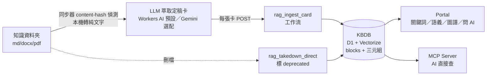

# Arcrun RAG — 安裝說明

> 你把檔案丟進資料夾，公司知識庫自動長出來。本文說明它是什麼、如何運作、有哪幾條安裝路徑。
> 面向「要導入的人」；最短的白話版在 [README](README.md)。

## Arcrun RAG 是什麼

很多企業需要 RAG（讓 AI 能查自己公司的知識），但 RAG 觀念複雜、難以自製。Arcrun RAG 把整套 RAG 元件——同步、轉檔、知識萃取、三種查詢——組合好一次提供，用戶不需要自行開發。

本產品用 [Arcrun](https://github.com/youlinhsieh/Arcrun) 開發（開源工作流引擎，定位「AI-Friendly 的 n8n」），以高速的 Cloudflare 全球網路做基礎設施。**self-hosted、不是 SaaS**：正式版裝在你自己申請的 Cloudflare 帳號裡，你自己擁有所有數據。

本機側只需要一支**同步器**（Mac／Windows 桌面程式）——不必裝 Docker、不必裝 Node.js、也不必另外裝 Python 轉檔工具（docx/pptx/pdf 轉純文字已內建在同步器裡）。

## 它如何運作

系統自動同步你的檔案、用 LLM 把原稿重寫成定稿知識卡、順手萃出三元組建知識圖譜，存進 KBDB 供三種模式查詢。分成幾層：

1. **知識資料夾 ＋ 同步器（collector daemon）**：你指定一個或多個資料夾，同步器固定間隔掃一輪（預設每 5 秒），用**內容雜湊（sha256）**判斷哪些檔案真的新增／修改／刪除（先用 mtime+size 快篩，變了才重算雜湊；改名以雜湊配對，不會誤下架）。**不經 git、不經任何版本庫**。docx/pptx/pdf 在你的電腦上轉成純文字。
2. **萃取（原稿 → 定稿知識卡）**：同步器把轉好的純文字送去 LLM 重寫成定稿卡（一句話定義／要點／關鍵實體／知識關聯）。預設走 **Workers AI**——打的是**你自己那套實例**的 `/portal/daemon/extract`，用你自己 Cloudflare 帳號內建的 AI，**不必申請任何金鑰**；也可以改用 Google Gemini（需自備 AI Studio key）。原始檔案（docx/pdf…）本身不出你的電腦，送出去的是本機轉出的純文字，回來的是知識卡。
3. **收卡入庫**：每張定稿卡 POST 進你實例的 `rag_ingest_card` 工作流 → 寫成 KBDB 的 blocks ＋三元組（知識圖譜的邊）。從資料夾刪檔則打 `rag_takedown_direct`，把對應內容標成 `deprecated` 下架（append-only、不物理刪，查詢自動略過）。**只有定稿卡進檢索，原稿不進庫**（LLM Wiki 策略；這是它跟「裸 RAG 切塊直餵向量庫」的差別）。
4. **KBDB（儲存與檢索層）**：Cloudflare D1 供關鍵詞查詢；內容向量化存進 Cloudflare Vectorize（index `arcrun-kbdb-embed-m3`：bge-m3／1024 維／cosine）供語義查詢；三元組構成圖譜，也是總庫知識地圖的基礎。
5. **查詢面**：Portal（人用的網頁：搜尋／知識卡／總圖／問 AI）＋ MCP Server（把端點掛給你的 AI，讓它直接查）。問答走 `rag_chat` 工作流——keyword＋semantic＋graph 三路檢索後由 AI 組出**帶出處**的答案。


```mermaid
flowchart LR
    A[知識資料夾<br>md/docx/pdf] -->|同步器 content-hash 偵測<br>本機轉純文字| B[LLM 萃取定稿卡<br>Workers AI 預設／Gemini 選配]
    B -->|每張卡 POST| C[rag_ingest_card<br>工作流]
    C --> D[(KBDB<br>D1 + Vectorize<br>blocks + 三元組)]
    A -.->|刪檔| T[rag_takedown_direct<br>標 deprecated]
    T --> D
    D --> E[Portal<br>關鍵詞／語義／圖譜／問 AI]
    D --> F[MCP Server<br>AI 直接查]
```

**入庫只有這一條路：同步器。** Portal 裡曾有的「網頁上傳」頁是舊示範站時代的功能（要另外設
`PORTAL_UPLOAD_REPO`／`PORTAL_UPLOAD_GITEA`／`PORTAL_UPLOAD_TOKEN` 三個變數指向一個 Gitea repo
才會出現），**新裝的實例預設沒有它**——nav 不顯示、端點回 404。

> 📌 收集器另有一組 `scan`／`upload`／`sync` 指令：把原稿以內容雜湊存進**你自己的 R2** 留底、再觸發雲端萃取。那條是**企業選配**路線，桌面同步器預設不走它。細節見 [collector/README.md](collector/README.md)。

## 安裝方式 1（推薦、主線）：一鍵安裝器

不用終端機、不用寫程式，裝進你自己的 Cloudflare 帳號（免費層即可起步）：

1. 到 **[rag.arcrun.dev](https://rag.arcrun.dev)** 留 Email，領一組「辨識碼」（封測期的邀請碼，會寄到信箱）。
2. 到 **[install.arcrun.dev](https://install.arcrun.dev)** 輸入 Email／辨識碼、按「開始安裝」——會跳到 Cloudflare 官方頁面請你確認授權，裝好直接給你一個只有你能用的網址。
3. 依畫面指示下載「同步器」（Mac／Win 桌面程式），指給它一個資料夾，之後丟進去的檔案就自動變知識庫。

裝完照 [Portal 5 分鐘導覽](docs/demo/客戶測試指南.md) 走一輪，就能把功能全摸過一遍
（⚠️ 該導覽的「步驟 1 上傳」寫的是舊示範站的網頁上傳頁，新裝實例預設沒有——改成往同步器監看的資料夾丟檔，後面步驟一樣）。

## 安裝方式 2：從原始碼裝到自己的 Cloudflare 帳號

適合對 Cloudflare／IT 有經驗、想先看代碼再裝的人；結果與方式 1 相同（同一套 workflow、同一個 Portal）。

👉 **[CF 安裝手冊（建議由你的 AI 執行）](docs/manual/cf-install-guide.md)**

## 安裝方式 3（進階，不推薦入門）：全本機測試安裝（不需要 Cloudflare 帳號）

適合想在自己電腦上評估引擎的工程師。前置：Docker、Node.js 22+、pnpm、全域 wrangler 4.98+、git。

```bash
./install/install.sh
```

⚠️ **這條路目前只驗得到引擎與查詢面，驗不到「丟檔就自動進庫」**：`install/install.sh` 的自動 ingest 段還停在舊架構（它仍會起一個 Gitea 容器並掛 push webhook），而舊的 Node 版收集器已於 2026-07-19 隨架構改版刪除——腳本的收集器步驟會直接跳過並印出說明。裝完可用的是：console（`http://127.0.0.1:8788/console`）、關鍵詞查詢、圖譜查詢（語義查詢本機無 Vectorize，會誠實降級為關鍵詞）。要體驗完整的「丟檔 → 查得到」，走方式 1 或 2。

全部移除：`./install/teardown.sh`。

逐步教學：[本機安裝手冊](docs/manual/product-install-guide.md)／[完整測試指南](docs/manual/local-test-guide.md)
（⚠️ 兩份都是 2026-07-12 版，內容仍描述 Gitea 時代的收集鏈，尚未跟上本文的架構）。

## 操作

裝完後的 Portal 目前可以做：

- **總庫搜尋**：關鍵詞／語義／圖譜三種模式查全庫，查得到 AI 重寫的定稿知識卡
- **知識卡片**：瀏覽每份文件萃出來的卡、來源溯源
- **總圖**：整座知識庫一張網（機械計算，不是 AI 生成）
- **問 AI**：直接問，拿到帶 [n] 出處編號的答案
- **MCP 接入**：把 MCP 端點掛給你的 AI（Claude 等），AI 直接查公司知識庫

**讓同事進來、控制權限**：Portal 管理頁可以發帳號給同事，並逐一勾選每個帳號可查詢的庫（例如財務庫僅財務部可查）。第一個管理員在安裝時建立。

---

*問題回報：在公開鏡像 [開 issue](https://github.com/youlinhsieh/arcrun-rag/issues)，或直接把「跑到哪一步＋完整指令＋完整錯誤訊息」回訊給邀請你的人。*
